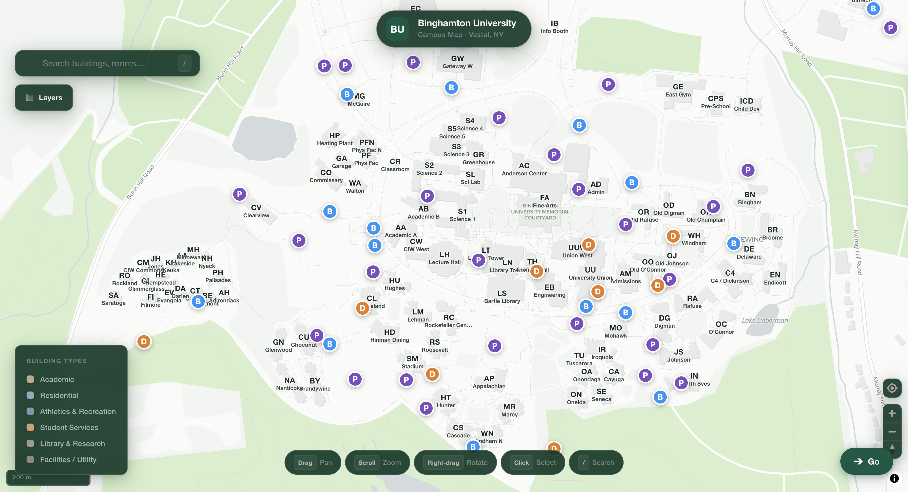
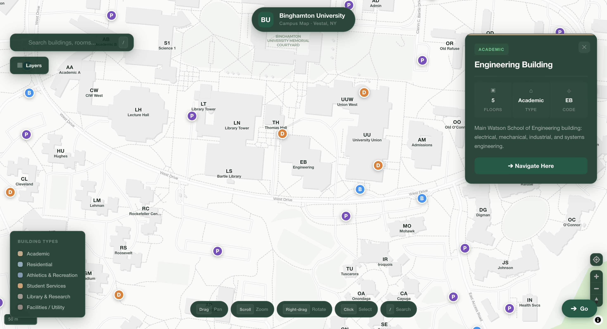
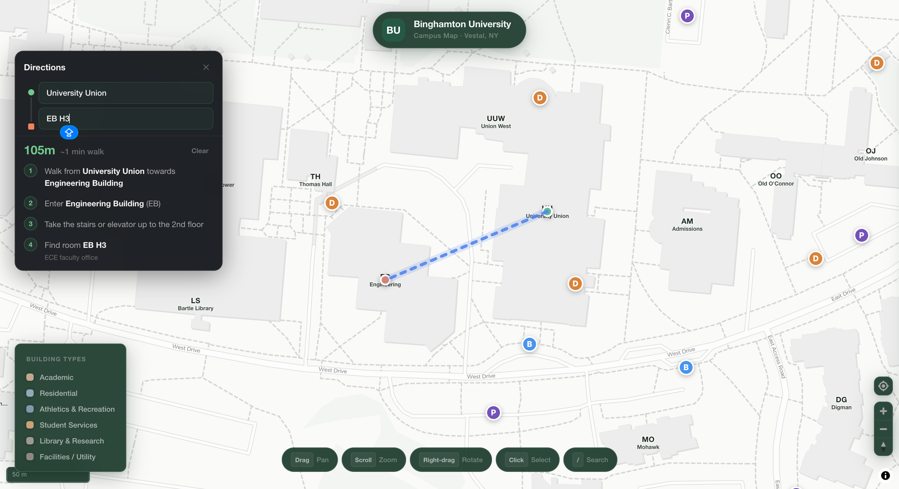
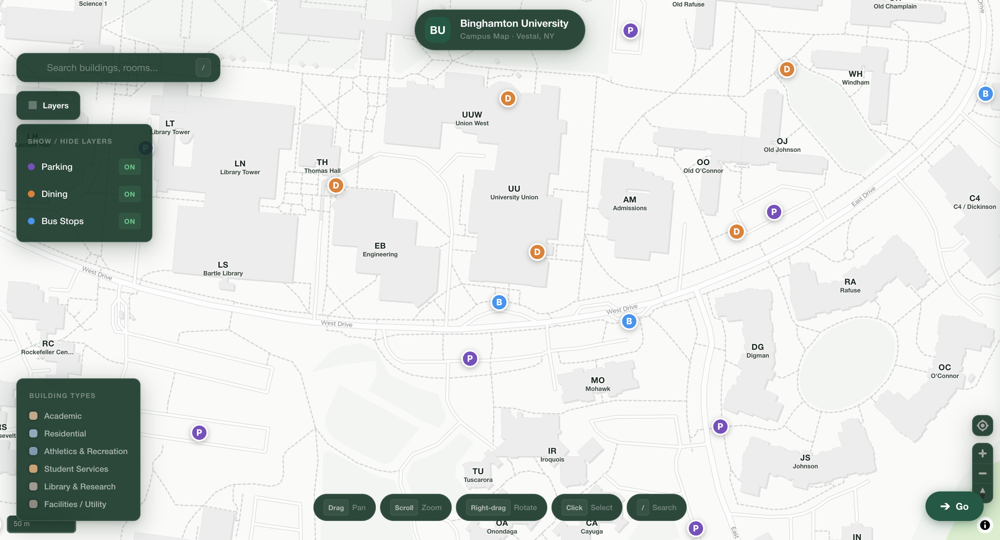

# BU Campus Map

A custom interactive campus map for Binghamton University (SUNY) in Vestal, NY. I built this as a better alternative to the current [binghamton.edu/maps](https://www.binghamton.edu/maps/) which just embeds Google Maps and doesn't really work well for navigating campus.

Uses [MapLibre GL JS](https://maplibre.org/) for the map rendering and [Vite](https://vitejs.dev/) for the build toolchain. No API keys needed — runs entirely on free tile servers.

## Screenshots

| Campus Overview | Building Info |
|:---:|:---:|
|  |  |

| Navigation & Directions | Search & POI Layers |
|:---:|:---:|
|  |  |

---

## What it does

**The map itself** — 115 campus buildings rendered as 3D extrusions from real GeoJSON footprint data. Each building is color-coded by type (academic, residential, athletics, etc.) and labeled with its code and name. Click any building to get a detail panel with description, floor count, and a navigate button. The map is bounded to campus so you can't accidentally scroll off to somewhere random.

**Navigation** — Works like a simplified Google Maps. Hit the Go button, pick a start point (your GPS location or any building), and search for a destination. Supports room-level search too — type something like "EB H3" and it'll find that specific ECE faculty office in the Engineering Building. Shows a route line on the map with step-by-step directions, including what floor to go to and how to find the room. If you're using GPS, the route updates live as you walk.

**Points of interest** — 27 parking lots, 9 dining locations, and 15 bus stops shown as colored markers on the map. Each one has a popup with useful info — parking links to TAPS, dining shows hours and Sodexo links, bus stops link to OCCT schedules and the ETA SPOT app. All toggleable from the Layers panel.

**Room search** — 18 buildings have full room databases (700+ rooms total). The Engineering Building alone has 55 rooms mapped across 5 floors with department breakdowns for ECE, ME, ISE, BME, and CS. You can search for a room from either the main search bar or the navigation panel.

## Getting started

```bash
git clone https://github.com/DevNagi31/BU-Map.git
cd BU-Map
npm install
npm run dev
```

Then open `http://localhost:5173`.

To build for production:

```bash
npm run build      # outputs to dist/
npm run preview    # preview the production build
```

## Tech

- **[MapLibre GL JS](https://maplibre.org/)** — map rendering, 3D building extrusions, markers, popups
- **[Carto Positron](https://carto.com/basemaps)** — base tiles (free, no token needed)
- **[Vite](https://vitejs.dev/)** — dev server + build
- **Vanilla JS** — no framework, just ES modules

## Project structure

```
bu-campus-map/
├── index.html              # UI shell — all styles, layout, panels, modals
├── package.json
├── vite.config.js
└── src/
    ├── main.js             # Map setup, building data, POIs, navigation, search
    ├── buildings-geo.json  # GeoJSON building footprints (~115 buildings)
    └── rooms.js            # Room databases for 18 buildings (700+ rooms)
```

## Controls

| Input | What it does |
|---|---|
| Drag | Pan the map |
| Scroll | Zoom in/out |
| Right-drag | Rotate the view |
| Click a building | Opens the info panel |
| Click a POI marker | Shows popup with details and links |
| `/` key | Jump to search |
| Go button | Opens the navigation panel |

## Building color coding

| Type | Color | Examples |
|---|---|---|
| Academic | Warm orange | Engineering, Sciences, Fine Arts, Lecture Hall |
| Residential | Slate blue | Hinman, CIW, Newing, Dickinson |
| Athletics | Blue | Events Center, East/West Gym, Stadium |
| Student Services | Orange-brown | University Union, Admissions, Admin |
| Library | Amber | Bartle Library, Library Tower |
| Facilities | Gray | Heating Plant, Physical Facilities |

## License

MIT
